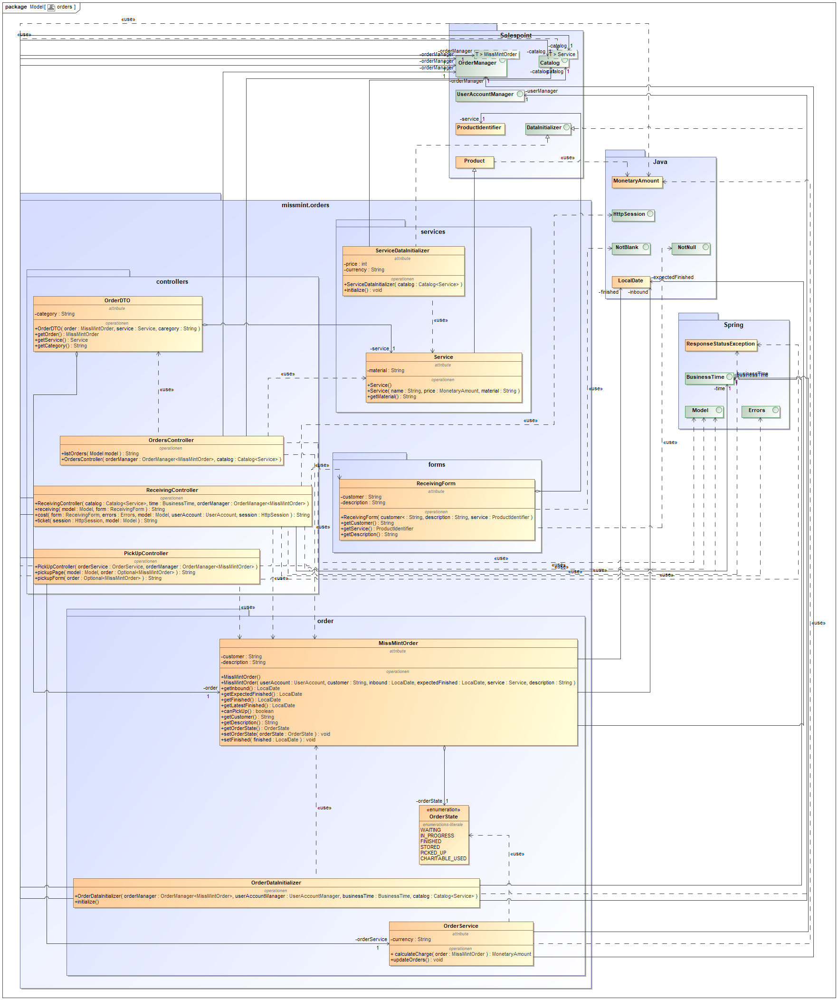
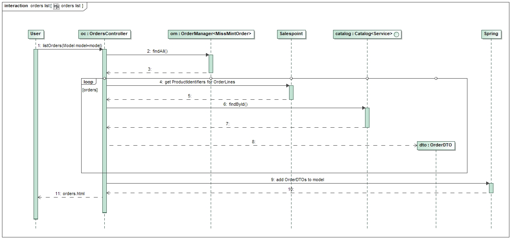
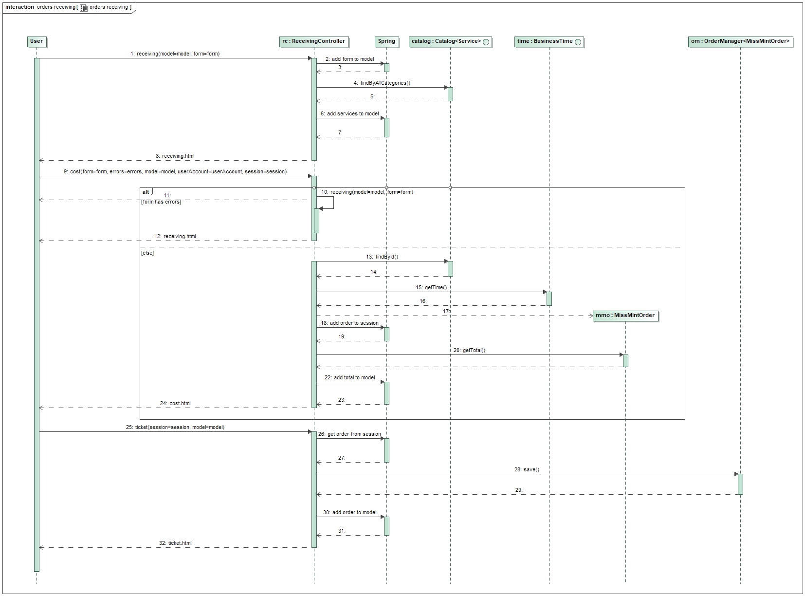
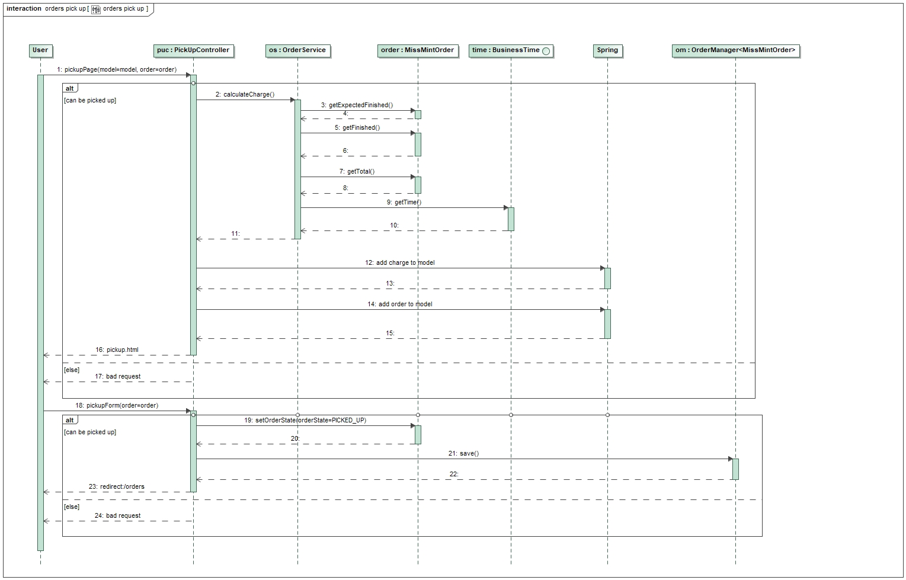
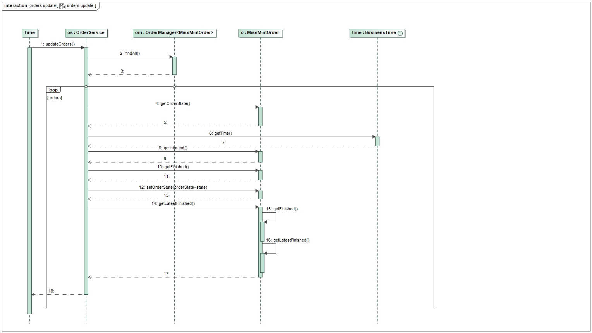

= Entwicklerdokumentation
[options="header"]
[cols="1, 3, 3"]
|===
|Version | Bearbeitungsdatum   | Autor 
|...	| ... | ...
|===

:project_name: Entwicklerdokumentation
:toc: left
:numbered:

== Einführung und Ziele
=== Aufgabenstellung
*TODO*

=== Qualitätsziele

Wartbarkeit::
Dieses Merkmal gibt den Grad an Effektivität und Effizienz an,
mit dem ein Produkt oder System modifiziert werden kann, um es zu verbessern,
zu korrigieren oder an Änderungen in der Umgebung und in den Anforderungen anzupassen.

Nutzerfreundlichkeit::
Grad, in dem ein Produkt oder System von bestimmten Benutzern verwendet werden kann,
um bestimmte Ziele mit Effektivität, Effizienz und Zufriedenheit in einem bestimmten Verwendungskontext zu erreichen.

Sicherheit::
Grad des Schutzes von Informationen und Daten durch ein Produkt oder System,
sodass Personen oder andere Produkte oder Systeme über den Datenzugriff verfügen,
der für ihre Art und ihre Berechtigungsstufe angemessen ist.

Desgin::
Gestaltung der Benutzeroberfläche, um die visuelle Wahrnehmung des Kunden zu beeinflussen,
und so die Informationsvermittlung und Nutzerfreundlichkeit zu steigern.
Dies beinhaltet Optimierungen für verschiedene Auflösungen und verschiedene Browser.
Wichtig ist auch die visuelle Differenzierung von Inhalten, um die Informationsaufnahme des Kunden zu lenken.

1 = Nicht wichtig ..
5 = Sehr wichtig

[options="header",cols="3h, ^1, ^1, ^1, ^1, ^1"]
|===
|Qualitätsanspruch        | 1 | 2 | 3 | 4 | 5
|Wartbarkeit              |   |   |   | x |
|Benutzerfreundlichkeit   |   |   |   |   | x
|Sicherheit               |   |   |   | x |
|Design                   |   | x |   |   |
|===

== Randbedingungen

=== Hardware-Vorgaben
Eine Liste von Geräten/Hardware, die benötigt werden um die Software zu benutzen.

* Server
* Computer
* Tastatur
* Maus

=== Software-Vorgaben

Die Anwendung setzt folgende Software voraus:

* Java 11 oder neuer
* Mozilla Firefox 70+
* Chromium 78+

=== Vorgaben zum Betrieb des Software

Die Software wird ausschließlich von _Miss Mint Mending Points_ Mitarbeiter verwendet.
Das System stellt Funktionen für die Annahme, Reparaturplanung, Ausgabe und Lagerung der Ware,
sowie die Verwaltung der Ressourcen zur Verfügung. Zudem erhält der Filialleiter Einsicht auf
die Finanzen.

Die Software soll rund um die Uhr in Betrieb sein und nur über das interne Firmennetz erreichbar sein.

Die Hauptnutzer der Software sind Mitarbeiter, die typische Website-Navigationsschemata kennen, sowie ein Filialleiter (Admin), der nicht unbedingt über einen technischen Hintergrund verfügt.

Das System muss nicht technisch gewartet werden.
Alle Daten müssen dauerhaft in einer Datenbank gespeichert sein und über die Applikation zugänglich sein (z.B. sollten für einen Filialleiter keine SQL-Kenntnisse erforderlich sein).

== Kontextabgrenzung

image:srs/models/context_diagram.png[context diagram]

== Lösungsstrategie
=== Erfüllung der Qualitätsziele
[options="header", cols="1,4"]
|=== 
|Qualitätsziel
|Lösungsansatz

|Wartbarkeit
a|
- *Modularität*: Zusammensetzen der Anwendung aus möglichst eigenständigen Modulen um den Einfluss den die Änderung eines Moduls auf andere Module hat zu minimieren.
- *Wiederverwendbarkeit*: Sicherstellung der Wiederverwendbarkeit von Modulen durch andere Systemkomponenten
- *Modifizierbarkeit*: Die Anwendung sollte ohne Verschlechterung der Code-Qualität oder Auftreten von Fehlern veränderbar  und/oder erweiterbar sein.
|Nutzerfreundlichkeit
a|
- *Erlernbarkeit*: Das System sollte verständlich und einfach bedienbar sein. Das lääst sich z.B. durch eindeutige Beschreibung von Eingaben mit Hilfe von Tooltips und/oder Labels realisieren. 
- *Handhabung von Fehlern*: Nutzer sollten vor Fehlern geschützt werden. Eingaben dürfen unter keinen Umständen zu ungültigen Systemzuständen führen.
- *Ästhetik der Nutzerschnittstelle*: Bereitstellung einer ansprechenden und zufriedenstellenden Interaktion für den Nutzer
- *Zugänglichkeit*: Es sollte, z.B. durch die Nutzung passender Schriftgrößen und Kontraste, sichergestellt werden dass Menschen mit einer möglichst großen Bandbreite von Eigenschaften die Möglichkeiten des Systems vollständig nutzen können.

|Sicherheit
a|
- *Vertraulichkeit*: Daten dürfen nur von Menschen mit den dafür nötigen Zugriffsrechten eingesehen werden. Dies kann mit Spring Security und dem Thymeleaf (`sec:authorize` - tag) realisiert werden.
- *Integrität*: Nicht-autorisierte Modifikationen sollten verhindert werden. Däfur kann die Spring Security (`@PreAuthorize` - annotation) verwendet werden.
- *Verantwortung*: Nachverfolgbarkeit von Aktionen oder Ereignissen zu einer eindeutigen Entität oder Person.

*TO DO: Applikationsspezifische Verlinkung hinzufügen siehe Videoshop*

|===

=== Softwarearchitektur

image:srs/models/top-level_architecture.png[Top-Level-Architekur]

// Client-Server-Diagramm nicht notwendig, da Top-Level-Architektur vorhanden.

=== Entwurfsentscheidungen
==== Verwendete Muster
* *Model View Controller* mit Spring MVC
* *Singleton mit Springs* `@Component` etc.
* *Value Object* mit `MonetaryAmount` etc.
* *Data Transfer Object* mit `OrderDTO`, um Daten für Templates zu aggregieren.
* *Dependency Injection* über die Konstruktoren in Spring-Komponenten
* *Repository* mit den Spring-Repositories

==== TODO
* Persistenz

Die Anwendung verwendet Hibernate-Annotation-basiertes Mapping,
um Java-Klassen Datenbanktabellen zuzuordnen.
Als Datenbank wird H2 verwendet. Die Persistenz ist standardmäßig deaktiviert.

* Benutzeroberfläche
* Verwendung externer Frameworks

[options="header", cols="1,3,3"]
|===
|Externe Klasse |Pfad der externen Klasse |Verwendet von (Klasse der eigenen Anwendung)
|... |... |...
|===

== Bausteinsicht
* Entwurfsklassendiagramme der einzelnen Packages

[options="header"]
|=== 
|Klasse/Enumeration |Description
|===

=== Aufträge

[options="header", cols="1, 4"]
|===
|Klasse/Enumeration |Description
|OrdersController |
Ein Spring MVC Controller, der Anfragen für die Anzeige der aktuellen Aufträge `MissMintOrder` beantwortet.
|OrderDTO |
Diese Klasse dient nur dem Datentransfer zum `orders.html`-Template.
|PickUpController |
Ein Spring MVC Controller, der Anfragen für die Rückgabe von Gegenständen an den Kunden handhabt.
Dazu berechnet die Klasse auch anfallende Kosten.
|ReceivingController |
Ein Spring MVC Controller, der Anfragen für die Aufnahme von Aufträgen `MissMintOrder` in das System beantwortet.
Dazu berechnet die Klasse auch anfallende Kosten.
|ReceivingForm |
Eine Klasse, um die Mitarbeiter-Eingaben für die Annahme zu validieren.
|MissMintOrder |
Diese Klasse ist eine Erweiterung der Salespoint `Order`. Sie enthält Kunden-, Dienstleistungens- und Zeit-Informationen.
Zudem hat der Auftrag einen Zustand.
|OrderDataInitializer |
Eine Implementation des ``DataInitializer``s, um einige vordefinierten Aufträge zum Testen anzulegen.
|OrderService |
Ein Dienst, der Hilfsfunktionen für die Auftrags-Verwaltung bereitstellt.
|OrderState  |
Eine Enumeration für die Zustände der Aufträge.
|Service |
Erweiterung des Salespoint ``Product``s, um es von anderen Produkten in der späteren Software abzugrenzen.
Im Prototypen speichert es auch noch das Material.
|ServiceDataInitializer  |
Eine Implementation des ``DataInitializer``s, um die einzelnen Dienstleistungen anzulegen.
|===

=== Rückverfolgbarkeit zwischen Analyse- und Entwurfsmodell

[options="header"]
|===
|Klasse/Enumeration (Analysemodell) |Klasse/Enumeration (Entwurfsmodell)
|===

== Laufzeitsicht
// * Komponentenbezogene Sequenzdiagramme, welche darstellen, wie die Anwendung mit externen Frameworks (zB. Salespoint, Spring) interagiert.

=== Aufträge

== Technische Schulden
* Auflistung der nicht erreichten Quality Gates und der zugehörigen SonarQube Issues

