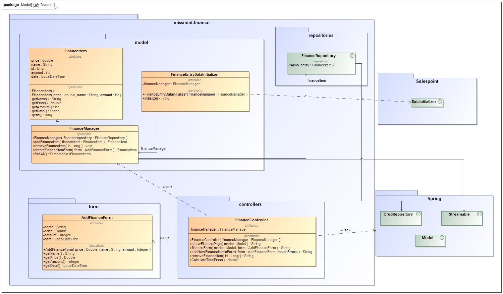
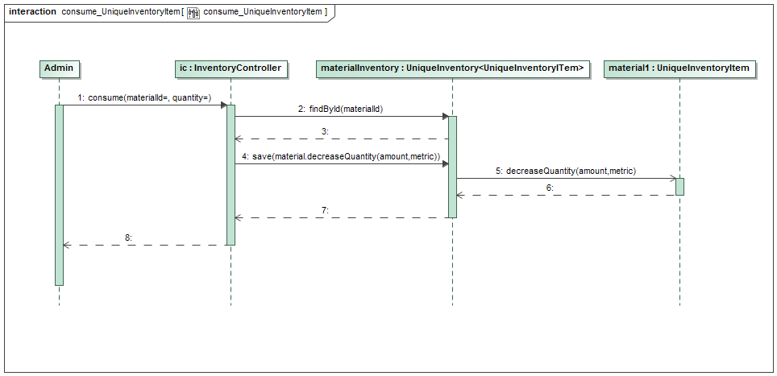
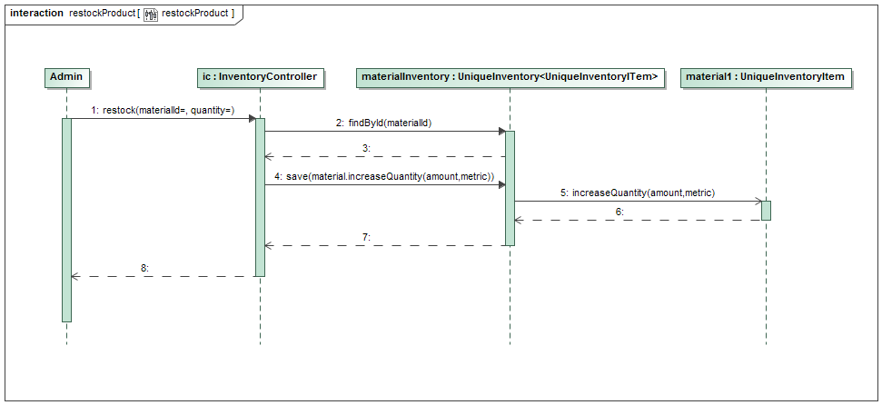
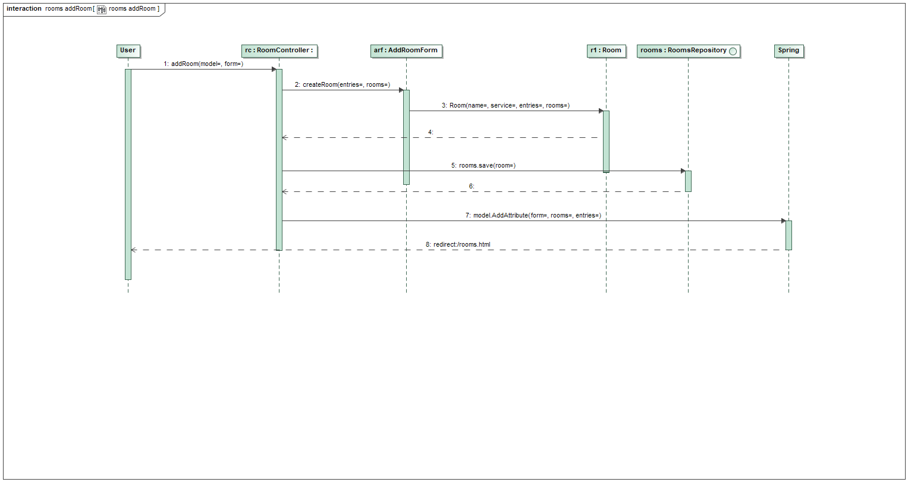
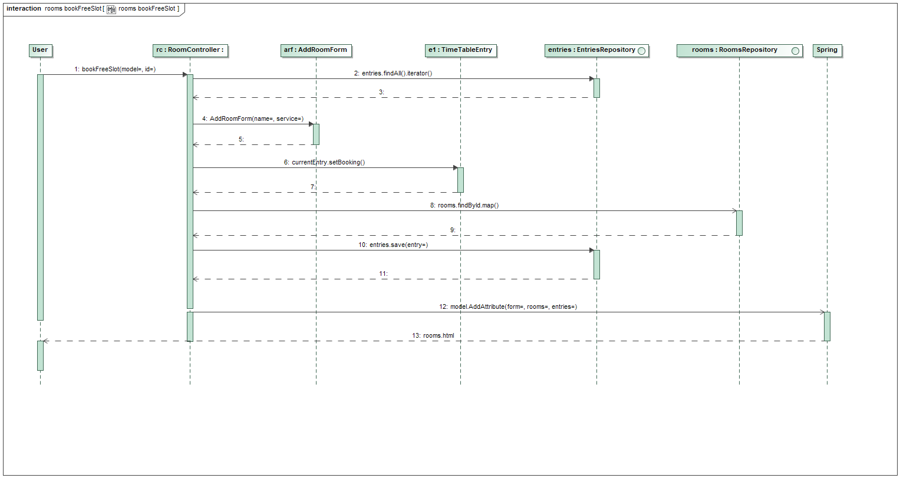
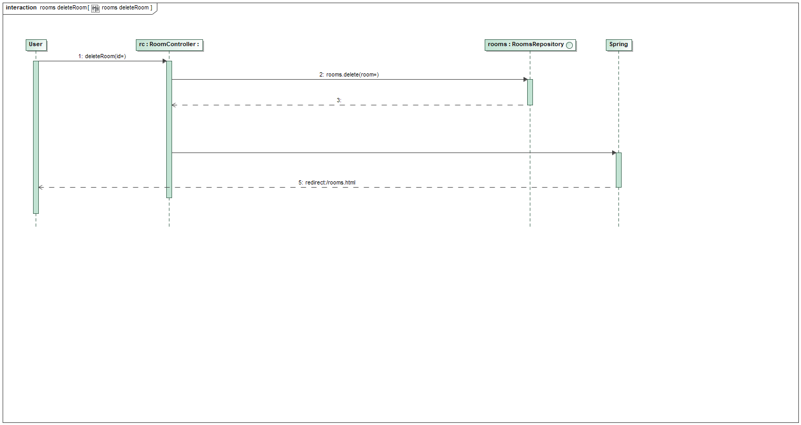
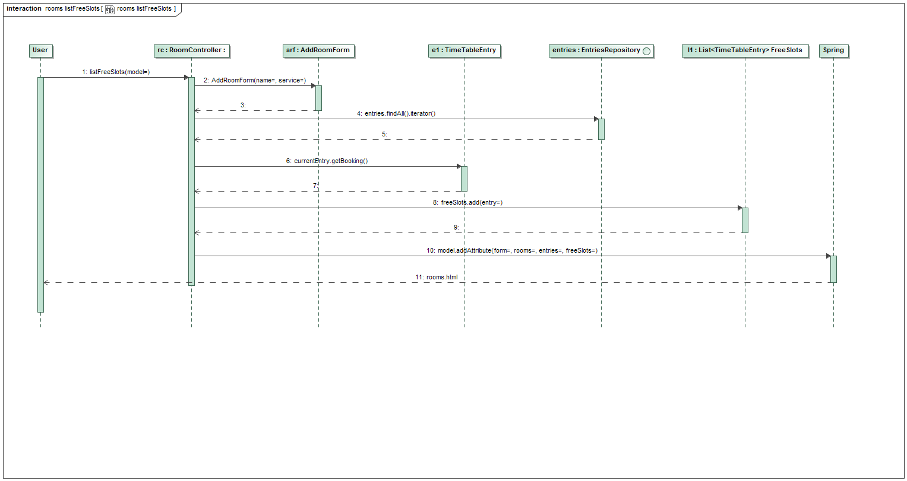

= Entwicklerdokumentation

[options="header", cols="1, 3, 3"]
|===
|Version | Bearbeitungsdatum   | Autor 
|1.0.0	 | 17.11.2019          | Till Große, Tobias Köllner, Anna Lopatkina, Kien Dang Tran, Viktor Reusch
|===

:project_name: Entwicklerdokumentation
:toc: left
:numbered:

== Einführung und Ziele
=== Aufgabenstellung
Für _Miss-Mint Mending Points_ soll für die Mitarbeiter eine Software bereitgestellt werden.
Mitarbeiter (_Staff_) können über den Admin registriert (_registerStaff_) und entlassen (_deleteUser_) werden.
Unauthorisierte Personen sollen keinen Zugriff auf betriebsinterne Bereiche bekommen (`@PreAuthorize("isAuthenticated()")`).
Der Betrieb stellt folgende Dienstleistungen (_MissMintService_) in Kategorien (_ServiceCategory_) bereit:

* eine Flickschusterei (_KLUDGE_)
* einen Nähservice (_SEWING_)
* einen Schlüsseldienst (_LOCKSMITH_)
* eine Schnellreinigung (_CLEANING_)
* eine Elektrowerkstatt (_ELECTRONICS_)
* eine Scherenschleiferei (_GRINDERY_)

Nachdem der Kunde eine Dienstleistung ausgewählt und im Voraus bezahlt hat, wird ein
Auftrag (_MissMintOrder_) mit einer Auftragsnummer (_OrderIdentifier_) im System angelegt.
Zusätzlich wird ein erwartetes Fertigstellungsdatum (_getExpectedFinished_) berechnet,
indem ein Bearbeitungstermin (_TimeTableEntry_) im Zeitplan registriert wird (_createEntry_).
Der Auftrag kann sich in verschiedenen Zuständen (_OrderState_) befinden.

Für die Bearbeitung der Aufträge wird eine Raumplanung inklusive Zeitplan zur Verfügung gestellt.
Dementsprechend werden Räume (_Room_) passend zur Dienstleistung gebucht. Für die Dienste
wird i. A. Material (_Material_) benötigt. Diese können, falls nötig, nachbestellt werden und die
Kosten werden automatisch vom System erfasst (_checkAndConsume_).

Ab dem Fertigstellungstermin kann die Ware eine Woche lang unter Vorlage des Auftragszettels abgeholt werden (_FINISHED_).
Danach wandert die Ware für drei Monate in eine Aufbewahrungsstelle (_STORED_), wo sie unter Vorlage des Auftragszettels
durch Zahlung einer Aufbewahrungsgebühr von 0,50€ pro Woche ausgelöst werden kann. Waren, die
auch in diesem Zeitraum nicht abgeholt werden, fallen anschließend an eine karitative Organisation (_CHARITABLE_USED_).
Umgekehrt wird für jeden ganzen verspäteten Tag Kosten in Höhe von 10% (bis maximal 100%) erstattet (_calculateCharge_).

Jegliches Einkommen bzw. Ausgaben sind für den Filialleiter sichtbar (_showFinancePage_).
Dabei ist auch eine Übersicht über den letzten Monat zur Abbuchung der Gewinne an den Mutterkonzern möglich (_showLastMonth_).

=== Qualitätsziele

Wartbarkeit::
Dieses Merkmal gibt den Grad an Effektivität und Effizienz an,
mit dem ein Produkt oder System modifiziert werden kann, um es zu verbessern,
zu korrigieren oder an Änderungen in der Umgebung und in den Anforderungen anzupassen.

Nutzerfreundlichkeit::
Grad, in dem ein Produkt oder System von bestimmten Benutzern verwendet werden kann,
um bestimmte Ziele mit Effektivität, Effizienz und Zufriedenheit in einem bestimmten Verwendungskontext zu erreichen.

Sicherheit::
Grad des Schutzes von Informationen und Daten durch ein Produkt oder System,
sodass Personen oder andere Produkte oder Systeme über den Datenzugriff verfügen,
der für ihre Art und ihre Berechtigungsstufe angemessen ist.

Desgin::
Gestaltung der Benutzeroberfläche, um die visuelle Wahrnehmung des Kunden zu beeinflussen,
und so die Informationsvermittlung und Nutzerfreundlichkeit zu steigern.
Dies beinhaltet Optimierungen für verschiedene Auflösungen und verschiedene Browser.
Wichtig ist auch die visuelle Differenzierung von Inhalten, um die Informationsaufnahme des Kunden zu lenken.

1 = Nicht wichtig ..
5 = Sehr wichtig

[options="header",cols="3h, ^1, ^1, ^1, ^1, ^1"]
|===
|Qualitätsanspruch        | 1 | 2 | 3 | 4 | 5
|Wartbarkeit              |   |   |   | x |
|Benutzerfreundlichkeit   |   |   |   |   | x
|Sicherheit               |   |   |   | x |
|Design                   |   | x |   |   |
|===

== Randbedingungen

=== Hardware-Vorgaben
Eine Liste von Geräten/Hardware, die benötigt werden um die Software zu benutzen:

* Server
* Computer
* Tastatur
* Maus

=== Software-Vorgaben

Die Anwendung setzt folgende Software voraus:

* Java 11 oder neuer
* Mozilla Firefox 70+
* Chromium 78+

=== Vorgaben zum Betrieb des Software

Die Software wird ausschließlich von _Miss Mint Mending Points_ Mitarbeiter verwendet.
Das System stellt Funktionen für die Annahme, Reparaturplanung, Ausgabe und Lagerung der Ware,
sowie die Verwaltung der Ressourcen zur Verfügung. Zudem erhält der Filialleiter Einsicht auf
die Finanzen.

Die Software soll rund um die Uhr in Betrieb sein und nur über das interne Firmennetz erreichbar sein.

Die Hauptnutzer der Software sind Mitarbeiter, die typische Website-Navigationsschemata kennen, sowie ein Filialleiter (Admin), der nicht unbedingt über einen technischen Hintergrund verfügt.

Das System muss technisch gewartet werden, da Sicherheitsupdates für Java aber auch die verwendeten Frameworks eingespielt werden müssen.
Alle Daten müssen dauerhaft in einer Datenbank gespeichert sein und über die Applikation zugänglich sein (z.B. sollten für einen Filialleiter keine SQL-Kenntnisse erforderlich sein).

== Kontextabgrenzung

image:srs/models/Context_Diagram.png[context diagram]

== Lösungsstrategie
=== Erfüllung der Qualitätsziele
[options="header", cols="1,4"]
|=== 
|Qualitätsziel
|Lösungsansatz

|Wartbarkeit
a|
- *Modularität*: Zusammensetzen der Anwendung aus möglichst eigenständigen Modulen um den Einfluss
den die Änderung eines Moduls auf andere Module hat zu minimieren.
- *Wiederverwendbarkeit*: Sicherstellung der Wiederverwendbarkeit von Modulen durch andere Systemkomponenten
- *Modifizierbarkeit*: Die Anwendung sollte ohne Verschlechterung der Code-Qualität oder Auftreten von Fehlern veränderbar
und/oder erweiterbar sein.
|Nutzerfreundlichkeit
a|
- *Erlernbarkeit*: Das System sollte verständlich und einfach bedienbar sein.
Das lässt sich z.B. durch eindeutige Beschreibung von Eingaben mit Hilfe von Tooltips und/oder Labels realisieren.
- *Handhabung von Fehlern*: Nutzer sollten vor Fehlern geschützt werden.
Eingaben dürfen unter keinen Umständen zu ungültigen Systemzuständen führen.
- *Ästhetik der Nutzerschnittstelle*: Bereitstellung einer ansprechenden und
zufriedenstellenden Interaktion für den Nutzer
- *Zugänglichkeit*: Es sollte, z.B. durch die Nutzung passender Schriftgrößen und Kontraste,
sichergestellt werden dass Menschen mit einer möglichst großen Bandbreite von Eigenschaften die Möglichkeiten des Systems vollständig nutzen können.

|Sicherheit
a|
- *Vertraulichkeit*: Daten dürfen nur von Menschen mit den dafür nötigen Zugriffsrechten eingesehen werden.
Dies kann mit Spring Security und dem Thymeleaf (``sec:authorize``-Tag) realisiert werden.
- *Integrität*: Nicht-autorisierte Modifikationen sollten verhindert werden.
Dafür kann die Spring Security (`@PreAuthorize` - annotation) verwendet werden.
- *Verantwortung*: Nachverfolgbarkeit von Aktionen oder Ereignissen zu einer eindeutigen Entität oder Person.
|===

=== Softwarearchitektur

image:srs/models/Top-level_architecture.png[Top-Level-Architekur]

// Client-Server-Diagramm nicht notwendig, da Top-Level-Architektur vorhanden.

=== Entwurfsentscheidungen
==== Verwendete Muster
* *Model View Controller* mit Spring MVC
* *Singleton mit Springs* `@Component` etc.
* *Value Object* mit `MonetaryAmount` etc.
* *Data Transfer Object* mit den `Form`-Klassen, in denen Formulardaten aggregiert werden.
* *Dependency Injection* über die Konstruktoren in Spring-Komponenten
* *Repository* mit den Spring-Repositories

==== Persistenz

Die Anwendung verwendet Hibernate-Annotation-basiertes Mapping,
um Java-Klassen Datenbanktabellen zuzuordnen.
Als Datenbank wird H2 verwendet. Die Persistenz ist standardmäßig deaktiviert.
Um den Persistenzspeicher zu aktivieren, müssen die folgenden zwei Zeilen in der Datei
application.properties nicht kommentiert werden:

....
# spring.datasource.url=jdbc:h2:./db/missmint
# spring.jpa.hibernate.ddl-auto=update
....

==== Benutzeroberfläche
image::models/design/images/dialog.png[]

==== Verwendung externer Frameworks

[options="header", cols="1,3,3"]
|===
|Externe Klasse 
|Pfad der externen Klasse 
|Verwendet von (Klasse der eigenen Anwendung)

|Accountancy
|org.{zwsp}salespointframework.{zwsp}accountancy.{zwsp}Accountancy
|FinanceController, FinanceService

|AccountancyEntry
|org.{zwsp}salespointframework.{zwsp}accountancy.{zwsp}AccountancyEntry
|FinanceService

|Assert
|org.{zwsp}springframework.{zwsp}util.{zwsp}Assert
|CatalogDataInitializer, FinanceController, FinanceService, InventoryInitializer, MissMintOrder, MissMintService, OrderOverviewController, OrderService, PickUpController, PickUpService, ReceivingController, ReceivingService, ServiceDataInitializer, ServiceManager, Staff, StaffController, StaffInitializer, StaffManagement, TimeController, TimeService, TimeTableService, Utils

|BusinessTime
|org.{zwsp}salespointframework.{zwsp}time.{zwsp}BusinessTime
|FinanceService, IndexController, OrderService, ReceivingController, RoomService, SalaryService, TimeController, TimeService, TimeTableService

|Catalog
|org.{zwsp}salespointframework.{zwsp}catalog.{zwsp}Catalog
|CatalogDataInitializer, InventoryInitializer, MaterialManager, OrderItemController, OrderItemManager, OrderOverviewController, OrderService, ReceivingService, ServiceDataInitializer, ServiceManager

|Component
|org.{zwsp}springframework.{zwsp}stereotype.{zwsp}Component
|CatalogDataInitializer, FinanceDataInitializer, InventoryInitializer, Messages, RoomDataInitializer, ServiceDataInitializer, StaffInitializer

|Configuration
|org.{zwsp}springframework.{zwsp}context.{zwsp}annotation.{zwsp}Configuration
|Application

|Controller
|org.{zwsp}springframework.{zwsp}stereotype.{zwsp}Controller
|FinanceController, IndexController, InventoryController, OrderItemController, OrderOverviewController, PickUpController, ReceivingController, RoomController, StaffController, TimeController

|CrudRepository
|org.{zwsp}springframework.{zwsp}data.{zwsp}repository.{zwsp}CrudRepository
|EntryRepository, RoomRepository, StaffRepository

|DataInitializer
|org.{zwsp}salespointframework.{zwsp}core.{zwsp}DataInitializer
|CatalogDataInitializer, FinanceDataInitializer, InventoryInitializer, RoomDataInitializer, ServiceDataInitializer, StaffInitializer

|Database
|org.{zwsp}hibernate.{zwsp}dialect.{zwsp}Database
|Room

|EURO
|org.{zwsp}salespointframework.{zwsp}core.{zwsp}Currencies.{zwsp}EURO
|CatalogDataInitializer

|EnableSalespoint
|org.{zwsp}salespointframework.{zwsp}EnableSalespoint
|Application

|Errors
|org.{zwsp}springframework.{zwsp}validation.{zwsp}Errors
|FinanceController, ReceivingController, RoomController, StaffController

|GetMapping
|org.{zwsp}springframework.{zwsp}web.{zwsp}bind.{zwsp}annotation.{zwsp}GetMapping
|FinanceController, IndexController, InventoryController, OrderOverviewController, PickUpController, ReceivingController, StaffController

|HttpSecurity
|org.{zwsp}springframework.{zwsp}security.{zwsp}config.{zwsp}annotation.{zwsp}web.{zwsp}builders.{zwsp}HttpSecurity
|Application

|HttpStatus
|org.{zwsp}springframework.{zwsp}http.{zwsp}HttpStatus
|PickUpController, Utils

|Interval
|org.{zwsp}salespointframework.{zwsp}time.{zwsp}Interval
|FinanceService

|InventoryItemIdentifier
|org.{zwsp}salespointframework.{zwsp}inventory.{zwsp}InventoryItemIdentifier
|InventoryController, MaterialForm, MaterialManager

|LocaleContextHolder
|org.{zwsp}springframework.{zwsp}context.{zwsp}i18n.{zwsp}LocaleContextHolder
|Messages

|LoggedIn
|org.{zwsp}salespointframework.{zwsp}useraccount.{zwsp}web.{zwsp}LoggedIn
|ReceivingController

|MessageSource
|org.{zwsp}springframework.{zwsp}context.{zwsp}MessageSource
|Messages

|MessageSourceAccessor
|org.{zwsp}springframework.{zwsp}context.{zwsp}support.{zwsp}MessageSourceAccessor
|Messages

|Metric
|org.{zwsp}salespointframework.{zwsp}quantity.{zwsp}Metric
|CatalogDataInitializer, InventoryInitializer, Material, MaterialManager, ServiceConsumptionManager

|Model
|org.{zwsp}springframework.{zwsp}ui.{zwsp}Model
|FinanceController, IndexController, InventoryController, OrderItemController, OrderOverviewController, PickUpController, ReceivingController, RoomController, StaffController

|ModelAttribute
|org.{zwsp}springframework.{zwsp}web.{zwsp}bind.{zwsp}annotation.{zwsp}ModelAttribute
|InventoryController, ReceivingController, StaffController

|Money
|org.{zwsp}javamoney.{zwsp}moneta.{zwsp}Money
|CatalogDataInitializer, FinanceDataInitializer, FinanceService, OrderItem, OrderService, SalaryService, ServiceDataInitializer

|Order
|org.{zwsp}springframework.{zwsp}core.{zwsp}annotation.{zwsp}Order
|FinanceDataInitializer, ServiceDataInitializer

|Order
|org.{zwsp}salespointframework.{zwsp}order.{zwsp}Order
|MissMintOrder

|OrderManager
|org.{zwsp}salespointframework.{zwsp}order.{zwsp}OrderManager
|OrderItemController, OrderItemManager, OrderOverviewController, OrderService, PickUpService, ReceivingController, ReceivingService, TimeTableService

|Page
|org.{zwsp}springframework.{zwsp}data.{zwsp}domain.{zwsp}Page
|OrderItemController, OrderItemManager, OrderOverviewController

|Pageable
|org.{zwsp}springframework.{zwsp}data.{zwsp}domain.{zwsp}Pageable
|OrderItemController, OrderItemManager, OrderOverviewController, OrderService, TimeTableService

|Pair
|org.{zwsp}springframework.{zwsp}data.{zwsp}util.{zwsp}Pair
|CatalogDataInitializer, ServiceConsumptionManager, ServiceDataInitializer, TimeTableService

|Password
|org.{zwsp}salespointframework.{zwsp}useraccount.{zwsp}Password
|StaffInitializer, StaffManagement

|PathVariable
|org.{zwsp}springframework.{zwsp}web.{zwsp}bind.{zwsp}annotation.{zwsp}PathVariable
|OrderOverviewController, PickUpController, StaffController

|PostMapping
|org.{zwsp}springframework.{zwsp}web.{zwsp}bind.{zwsp}annotation.{zwsp}PostMapping
|FinanceController, InventoryController, PickUpController, ReceivingController, StaffController, TimeController

|PreAuthorize
|org.{zwsp}springframework.{zwsp}security.{zwsp}access.{zwsp}prepost.{zwsp}PreAuthorize
|FinanceController, InventoryController, OrderItemController, OrderOverviewController, PickUpController, ReceivingController, RoomController, StaffController, TimeController

|Product
|org.{zwsp}salespointframework.{zwsp}catalog.{zwsp}Product
|Material, MissMintService, OrderItem

|ProductIdentifier
|org.{zwsp}salespointframework.{zwsp}catalog.{zwsp}ProductIdentifier
|OrderItemController, OrderItemForm, OrderItemManager, OrderOverviewController, ReceivingForm, ServiceManager

|PropertySource
|org.{zwsp}springframework.{zwsp}context.{zwsp}annotation.{zwsp}PropertySource
|Application

|Quantity
|org.{zwsp}salespointframework.{zwsp}quantity.{zwsp}Quantity
|InventoryInitializer, MaterialManager, MissMintOrder, ReceivingService, ServiceConsumptionManager

|RequestMapping
|org.{zwsp}springframework.{zwsp}web.{zwsp}bind.{zwsp}annotation.{zwsp}RequestMapping
|IndexController

|ResponseStatusException
|org.{zwsp}springframework.{zwsp}web.{zwsp}server.{zwsp}ResponseStatusException
|PickUpController, Utils

|Role
|org.{zwsp}salespointframework.{zwsp}useraccount.{zwsp}Role
|StaffInitializer, StaffManagement

|SalespointSecurityConfiguration
|org.{zwsp}salespointframework.{zwsp}SalespointSecurityConfiguration
|Application

|Service
|org.{zwsp}springframework.{zwsp}stereotype.{zwsp}Service
|FinanceService, MaterialManager, OrderItemManager, OrderService, PickUpService, ReceivingService, RoomService, SalaryService, ServiceManager, StaffManagement, TimeService, TimeTableService

|Session
|org.{zwsp}hibernate.{zwsp}Session
|Utils

|SessionAttribute
|org.{zwsp}springframework.{zwsp}web.{zwsp}bind.{zwsp}annotation.{zwsp}SessionAttribute
|ReceivingController

|SpringApplication
|org.{zwsp}springframework.{zwsp}boot.{zwsp}SpringApplication
|Application

|StreamUtils
|org.{zwsp}springframework.{zwsp}data.{zwsp}util.{zwsp}StreamUtils
|TimeTableService

|Streamable
|org.{zwsp}springframework.{zwsp}data.{zwsp}util.{zwsp}Streamable
|EntryRepository, FinanceService, MaterialManager, ServiceManager, StaffRepository

|Transactional
|org.{zwsp}springframework.{zwsp}transaction.{zwsp}annotation.{zwsp}Transactional
|OrderItemManager, StaffManagement

|UniqueInventory
|org.{zwsp}salespointframework.{zwsp}inventory.{zwsp}UniqueInventory
|InventoryController, InventoryInitializer, MaterialManager, ReceivingService

|UniqueInventoryItem
|org.{zwsp}salespointframework.{zwsp}inventory.{zwsp}UniqueInventoryItem
|InventoryController, InventoryInitializer, MaterialManager, ReceivingService

|UserAccount
|org.{zwsp}salespointframework.{zwsp}useraccount.{zwsp}UserAccount
|MissMintOrder, ReceivingController, Staff, StaffManagement, StaffRepository

|UserAccountManager
|org.{zwsp}salespointframework.{zwsp}useraccount.{zwsp}UserAccountManager
|StaffInitializer, StaffManagement

|Value
|org.{zwsp}springframework.{zwsp}beans.{zwsp}factory.{zwsp}annotation.{zwsp}Value
|FinanceDataInitializer, FinanceService, OrderService, SalaryService, ServiceDataInitializer
|===

== Bausteinsicht
//* Entwurfsklassendiagramme der einzelnen Packages

//[options="header"]
//|===
//|Klasse/Enumeration |Beschreibung
//|===

=== Aufträge
image::models/design/images/orders_design.png[Klassendiagramm für das orders Paket,100%,100%,pdfwidth=100%,title="Klassendiagramm für das orders Paket",align=center]
[options="header", cols="1, 4"]
|===
|Klasse/Enumeration |Beschreibung
|OrderOverviewController |
Ein Spring MVC Controller, der Anfragen für die Anzeige der aktuellen Aufträge `MissMintOrder` beantwortet.
|PickUpController |
Ein Spring MVC Controller, der Anfragen für die Rückgabe von Gegenständen an den Kunden handhabt.
Dazu berechnet die Klasse auch anfallende Kosten.
|ReceivingController |
Ein Spring MVC Controller, der Anfragen für die Aufnahme von Aufträgen `MissMintOrder` in das System beantwortet.
Dazu berechnet die Klasse auch anfallende Kosten.
|ReceivingForm |
Eine Klasse, um die Mitarbeitereingaben für die Annahme zu validieren.
|MissMintOrder |
Diese Klasse ist eine Erweiterung der Salespoint `Order`. Sie enthält Kunden-, Dienstleistungen- und Zeit-Informationen.
Zudem hat der Auftrag einen Zustand.
|OrderService |
Ein Dienst, der Hilfsfunktionen für die Auftragsverwaltung bereitstellt.
|PickUpService |
Hilfsdienst für den Abholprozess, um den Controller von der Business-Logik zu trennen.
|ReceivingService |
Unterstützt den ReceivingController in der Handhabung von neuen Auufträgen.
|OrderState |
Eine Enumeration für die Zustände der Aufträge.
|MissMintService |
Erweiterung des Salespoint ``Product``s, um es von anderen Produkten in der späteren Software abzugrenzen.
|ServiceCategory |
Eine Enumeration mit den Dienstleistungskateorien.
|ServiceConsumptionManager |
Definiert den Verbrauch an Materialien für die verschiedenen Dienstleistungen.
|ServiceDataInitializer |
Eine Implementation des ``DataInitializer``s, um die einzelnen Dienstleistungen anzulegen.
|ServiceManager |
Ein Service, der Zugriffe und Operationen auf `MissMintService` wegabstrahiert.
|===

=== Mitarbeiter
image::models/design/images/users.png[]
|===
|Klasse/Enumeration/Schnittstelle |Beschreibung

|UserConstroller
|Ein Spring MVC Controller, der Anfragen bzgl. Mitarbeiterübersicht und zudem Erstellung, Bearbeitung
und Löschen von Mitarbeitern verarbeitet.

|User
|Jeder User hat eine eindeutige `Id`,
einen `UserAccount` von _SalesPoint_ und eine `UserAccountRole`.

|Staff
|Diese Klasse erweitert die `User` Klasse und implementiert das `Resource` `Interface`. Der Mitarbeiter hat Vor- und
Nachname. Er kann Fertigkeiten in einer oder mehreren Dienstleistungen haben.

|UserManagement
|Ein Dienst, der zuständig ist, die Mitarbeiter im System zu verwalten.

|StaffRepository
|Die Schnittstelle erweitert die `CrudRepository` von Spring. Sie ist verantwortlich für die Persistenz
der Mitarbeiterdaten.

|AccountRole
|Eine Enumeration um Mitarbeiter verschiedene Nutzerrechte zu geben.

|ServiceCategory
|Die Enumeration stellt die verschiedenen Dienstleistungen von _Miss Mint_-Betrieben dar.

|RegistrationForm
|Ein Formular für die Registrierung von neuen Mitarbeitern.

|EditStaffForm
|Ein Formular um Mitarbeiterdaten zu bearbeiten.

|===

=== Inventar
image::models/design/images/Inventory.png[]
[options="header", cols="1, 4"]
|===
|Klasse/Enumeration/Schnittstelle 
|Beschreibung

|CatalogController
|Ein Spring MVC Controller, der die zu den Bestellungen gehörenden Gegenstände anzeigt.

|CatalogDataInitializer
|Implementation des ``DataInitializer``s für den Produktkatalog

|InventoryController
|Ein Spring MVC Controller, der Anfragen bezüglich des Materialinventars annimmt.

|InventoryInitializer
|Implementation des ``DataInitializer``s für die Inventare der jeweiligen Produkte.

|orderItem, Material
|Erweiterung des Salespoint ``Product``s.

|===

=== Räume
image::models/design/images/rooms.png[]
[options="header", cols="1, 4"]
|===
|Klasse/Enumeration/Schnittstelle
|Beschreibung

|Room
|Klasse die die Räume repräsentiert. Räume stehen in enger Verbindung mit den Timeslots, wobei jeder Raum seine eigenen TimeSlots besitzt.

|Booking
|Enumeration für die verschiedenen Buchungsfälle der Timeslots.

|TimeTableEntry
|Diese Klasse repräsentiert Timeslots, die durch Buchung von Räumen in einer bestimmten Zeit zu vollwertigen Einträgen werden können.

|RoomController
|Ein Spring MVC Controller, der die Verwaltung von Räumen und das buchen von TimeSlots ermöglicht.

|AddRoomForm
|Diese Klasse prüft die Nutzereingabe auf fehler und erstellt ggf. einen neuen Raum.

|RoomsRepository
|Interface welches das Crud Repository von Spring erbt. Es speichert Raumeinträge.

|EntriesRepository
|Interface welches das Crud Repository von Spring erbt. Es speichert Einträge in TimeSlots.

|===

=== Finanzen

|===
|Klasse/Enumeration/Schnittstelle |Beschreibung

|FinanceConstroller
|Ein Spring Controller, der Anfragen bzgl. Financeübersicht und zudem Erstellung
und Löschen von FinanceEinträge verarbeitet.

|FinanceItem
|Jeder FinanceItem hat eine eindeutige `id`,
eine `price` , einen `name`, einen `amount` und eine `date` .

|FinaceManager
|Ein Dienst, der zuständig ist, die FinanceItem im System zu verwalten. Man kann dort FinanceItem Löschen und Hinfügen.

|FinanceRepository
|Die Schnittstelle erweitert die `CrudRepository` von Spring. Sie ist verantwortlich für die Persistenz
der Financedaten.

|FinanceEntryDataInitializer
|Ein Formular von _SalesPoint_ für die Initialisierung von FinanceItems.

|AddFinanceForm
|Ein Formular um FinanceItem hinzufügen.

|===

=== Time
*TODO IMAGE*

|===
|Klasse/Enumeration/Schnittstelle |Beschreibung

|TimeTableEntry
|Diese Klasse repräsentiert Zeitslots, die durch Buchung von Räumen in einer bestimmten Zeit erstellt werden.

|EntryRepository
|Interface welches das `CrudRepository` von Spring implementiert. Es speichert Objekte vom Typ TimeTableEntry.

|TimeController
|Schnittstelle, die den Nutzer ermöglicht, die Zeit vorzuspulen.

|TimeService
|Bildet das Backend für den TimeController.

|TimeTableService
|Dieser Service erledigt das Erstellen von Zeit-Slots und das Umsortieren dieser,
um rechtzeitige Fertigstellung zu ermöglichen.
|===

=== Rückverfolgbarkeit zwischen Analyse- und Entwurfsmodell

[options="header", cols="1, 1"]
|===
|Klasse/Enumeration (Analysemodell)|Klasse/Enumeration (Entwurfsmodell)

|Order 
|MissMintOrder

|Service
|MissMintService

|State
|OrderState

|Order Management
|OrderService

|Service Category 
|ServiceCategory

|OrderTicket
|-

|User 
|User

|Staff 
|Staff

|- 
|UserManagement

|Storage
|Inventory

|Material
|Inventory

|ResourceManagement
|-

|Resource
|orderItem, Material

|Room
|Room

|-
|Booking

|FinancialManagement
|FinanceManager

|FinancialItem
|FinancialItem

|TimeTableEntry
|TimeTableEntry

|TimeTable
|EntryRepository

|===

== Laufzeitsicht
// * Komponentenbezogene Sequenzdiagramme, welche darstellen, wie die Anwendung mit externen Frameworks (zB. Salespoint, Spring) interagiert.

=== Aufträge
image::models/design/images/sd__orders_list__orders_list.jpg[]
image::models/design/images/sd__orders_receiving__orders_receiving.jpg[]
image::models/design/images/sd__orders_pick_up__orders_pick_up.jpg[]
image::models/design/images/sd__orders_update__orders_update.jpg[]

=== Mitarbeiter
image::models/design/images/add_and_delete_staff.png[]

=== Inventar

=== Räume

////
== Technische Schulden
* Auflistung der nicht erreichten Quality Gates und der zugehörigen SonarQube Issues
////
